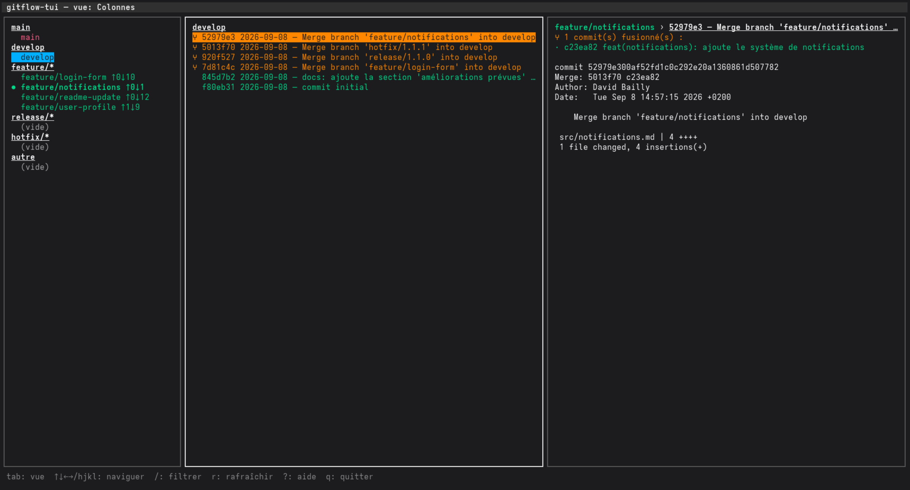

# gitflow-tui



Un TUI (interface en mode texte) pour visualiser la structure GitFlow d'un dépôt Git : quelles branches existent, ce qui a été fusionné où, et les écarts par rapport au workflow attendu.

**Lecture seule** : l'outil n'effectue aucune action d'écriture sur le dépôt.

## Prérequis

- Go 1.22 ou supérieur
- Git

## Installation

Depuis le dossier `src/` du projet :

```sh
go build -o gitflow-tui ./cmd/gitflow-tui
```

Place ensuite le binaire où tu veux (par exemple dans un dossier de ton `PATH`) pour pouvoir le lancer depuis n'importe quel dépôt.

## Utilisation

Lance `gitflow-tui` depuis n'importe quel répertoire à l'intérieur d'un dépôt Git :

```sh
cd /chemin/vers/mon-depot
gitflow-tui
```

## Les deux vues

### Vue Colonnes

Trois panneaux, façon navigateur de fichiers :

1. **Branches** — toutes les branches, groupées par type GitFlow (`main`, `develop`, `feature/*`, `release/*`, `hotfix/*`, `autre`).
2. **Commits / fusions** — l'historique de la branche sélectionnée. Les commits de fusion sont repérés (`⑂`, en orange) ; les autres commits sont en vert.
3. **Contenu** — le détail complet du commit sélectionné (message, fichiers, diff). Si c'est une fusion, la liste des commits qu'elle a apportés est affichée en premier.

### Vue Graphe

Une frise chronologique horizontale : `main` et `develop` sur leurs propres lignes, les branches éphémères (actives ou déjà fusionnées et supprimées) en dessous, avec les points de fusion repérés sur les lignes principales.

Elle a deux modes :
- **Historique** — tout ce qui s'est passé, y compris les branches supprimées reconstituées depuis les commits, et les écarts détectés par rapport au workflow GitFlow (fusion vers une cible inattendue, commit direct hors fusion, branche partie du mauvais parent...).
- **Direct** — uniquement les branches encore présentes localement et pas encore complètement fusionnées, sans analyse de l'historique.

## Raccourcis clavier

| Touche | Action |
|---|---|
| `Tab` | Basculer entre la vue Colonnes et la vue Graphe |
| `m` | Basculer Historique / Direct (vue Graphe) |
| `↑` `↓` / `j` `k` | Se déplacer dans le panneau actif (ou faire défiler le contenu) |
| `←` `→` / `h` `l` | Changer de panneau (vue Colonnes) |
| `/` | Filtrer les branches par nom (vue Colonnes) |
| `r` | Rafraîchir les données |
| `?` | Afficher/masquer l'aide |
| `q` / `Ctrl+C` | Quitter |
