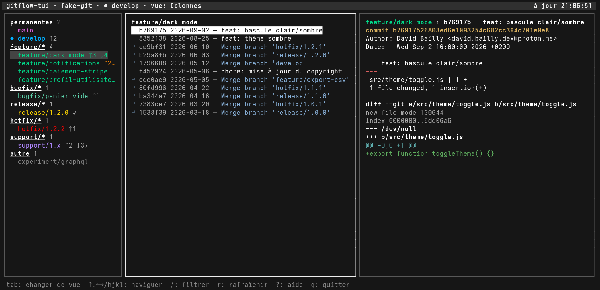

# gitflow-tui



Un TUI (interface en mode texte) pour visualiser la structure GitFlow d'un dépôt Git : quelles branches existent, ce qui a été fusionné où, et les écarts par rapport au workflow attendu.

**Lecture seule** : l'outil n'effectue aucune action d'écriture sur le dépôt.

## Prérequis

- Go 1.22 ou supérieur
- Git

## Installation

Depuis le dossier `src/` du projet :

```sh
go build -o gitflow-tui ./cmd/gitflow-tui
```

`gitflow-tui --version` affiche alors la révision git compilée (ex. `dev (875a15c)`). Pour une version publiée, injecte son numéro au build :

```sh
go build -ldflags "-X main.version=$(git describe --tags)" -o gitflow-tui ./cmd/gitflow-tui
```

Place ensuite le binaire où tu veux (par exemple dans un dossier de ton `PATH`) pour pouvoir le lancer depuis n'importe quel dépôt.

## Utilisation

Lance `gitflow-tui` depuis n'importe quel répertoire à l'intérieur d'un dépôt Git, ou passe-lui le chemin du dépôt :

```sh
cd /chemin/vers/mon-depot
gitflow-tui
# ou
gitflow-tui /chemin/vers/mon-depot
```

| Option | Effet |
|---|---|
| `--remote origin` | Analyse les branches du remote (`origin/*`) au lieu des branches locales : l'état partagé de l'équipe, même sur un clone sans `develop` local. Le rafraîchissement suit les `git fetch`. |
| `--stale-days 30` | Signale les branches pas encore fusionnées sans commit depuis ce nombre de jours (30 par défaut, `0` pour désactiver). |
| `--version`, `-v` | Affiche la version et quitte. |

### Conventions GitFlow

Si le dépôt a été initialisé avec `git flow init`, ses réglages sont repris : noms des branches permanentes (`gitflow.branch.master`, `gitflow.branch.develop`), préfixes des branches (`gitflow.prefix.feature`, `bugfix`, `release`, `hotfix`, `support`) et préfixe des tags de version (`gitflow.prefix.versiontag`). Sinon, les conventions habituelles s'appliquent : `main` (ou `master` à défaut), `develop`, `feature/`, `bugfix/`, `release/`, `hotfix/`, `support/`.

Les branches `bugfix/*` partent de develop et y reviennent, comme les features ; les branches `support/*` maintiennent une ancienne version à partir de main et ne sont jamais refusionnées.

L'affichage se met à jour de lui-même dès que le dépôt change (commit, fusion, changement, création ou suppression de branche), y compris depuis un autre terminal ou un worktree ; `r` force un rechargement.

## Les deux vues

### Vue Colonnes

Trois panneaux, façon navigateur de fichiers :

1. **Branches** — toutes les branches, groupées par type GitFlow (permanentes `main`/`develop`, `feature/*`, `bugfix/*`, `release/*`, `hotfix/*`, `support/*`, `autre`), chaque type dans sa couleur. À côté du nom : `✔` si la branche est fusionnée dans toutes ses cibles, `⚠` si seulement dans certaines, sinon `↑n`/`↓n`, son avance et son retard sur sa branche parente ; `◷nj` si elle est inactive depuis n jours. Pour `develop`, `↑n` compte les commits pas encore dans main (la prochaine release) et `↓n` les correctifs de main pas encore redescendus dans develop.
2. **Commits / fusions** — pour `main` et `develop`, leur historique direct ; pour les autres branches, leurs seuls commits propres, y compris une fois la branche fusionnée. Les commits de fusion sont repérés par `⑂` et une couleur à part.
3. **Contenu** — le détail complet du commit sélectionné (message, fichiers, diff coloré). Si c'est une fusion, la liste des commits qu'elle a apportés est affichée en premier.

La sélection est surlignée franchement dans le panneau actif, et plus discrètement dans les autres.

### Vue Graphe

Une frise chronologique horizontale : `main` et `develop` sur leurs propres lignes, les branches éphémères (actives ou déjà fusionnées et supprimées) en dessous, chacune reliée par un trait vertical à son repère `┬` sur la ligne principale. `↑` `↓` sélectionnent une branche du graphe et `Entrée` l'ouvre dans la vue Colonnes — pour une branche supprimée, sur son commit de fusion.

Les branches sont placées de gauche à droite par date de première fusion, ou de création si elles ne sont pas encore fusionnées ; un axe des dates surmonte le diagramme. Si le diagramme dépasse la largeur du terminal, `←` `→` le font défiler horizontalement.

L'orange est réservé aux écarts au workflow GitFlow ; `?` affiche la légende complète des symboles.

Elle a deux modes :
- **Historique** — ce qui s'est passé, y compris les branches supprimées reconstituées depuis les messages de fusion (git, GitHub, GitLab, Bitbucket), et les écarts détectés par rapport au workflow GitFlow : fusion vers une cible inattendue, release ou hotfix jamais refusionnée dans l'une de ses cibles, fusion dans main sans tag de version (si le dépôt en utilise), commit direct hors fusion, branche partie du mauvais parent, synchronisation directe `develop` → `main`, branche inactive. Par défaut, seuls ces **écarts** sont affichés ; `a` bascule vers l'historique complet. Les tags de version apparaissent à côté des fusions dans main (`◆ v1.2.0`), et le nombre de commits en attente de la prochaine release sous develop.
- **Direct** — uniquement les branches encore présentes localement et pas encore complètement fusionnées, sans analyse de l'historique.

Les intégrations de pull request en squash (sujet terminé par `(#12)`) ne sont pas signalées comme commits directs. Une intégration en « rebase and merge » ne laisse en revanche aucune trace reconnaissable : ses commits apparaissent comme directs.

## Raccourcis clavier

| Touche | Action |
|---|---|
| `Tab` | Basculer entre la vue Colonnes et la vue Graphe |
| `m` | Basculer Historique / Direct (vue Graphe) |
| `a` | Basculer écarts seulement / historique complet (vue Graphe, mode Historique) |
| `↑` `↓` / `j` `k` | Se déplacer dans le panneau actif ou faire défiler le contenu (vue Colonnes) / sélectionner une branche (vue Graphe) |
| `←` `→` / `h` `l` | Changer de panneau (vue Colonnes) / défiler horizontalement (vue Graphe) |
| `Entrée` | Ouvrir la branche sélectionnée dans la vue Colonnes (vue Graphe) |
| `PgUp` `PgDn` | Faire défiler le graphe verticalement |
| `/` | Filtrer les branches par nom (vue Colonnes) |
| `r` | Rafraîchir les données |
| `?` | Afficher/masquer l'aide et la légende des symboles |
| `q` / `Ctrl+C` | Quitter |
